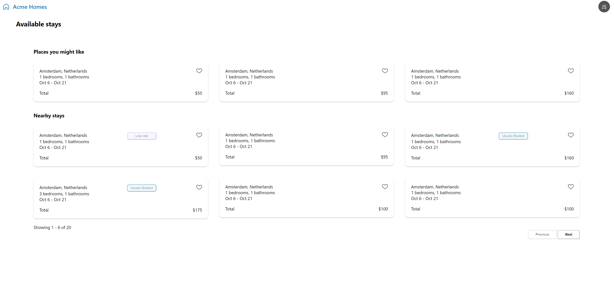

# HPE Acme Homes
This project is based off of the HPE Design System Starter [Found here](https://github.com/grommet/hpe-design-system-starter)

## Objectives
Some things that need work.
1. Favourite Icon
2. HR divider/seperator
3. Fonts styling & overall spacing
4. styling of last page gets ruined

## Setup
Once you have this repo cloned you can run `yarn` or `npm install` to get started. `npm start` to run.

